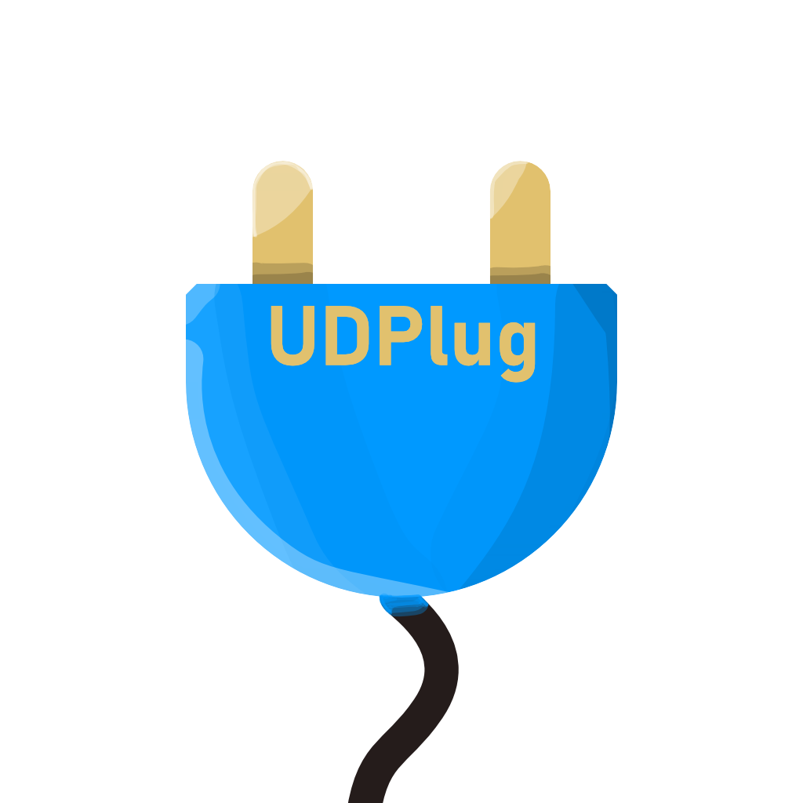

# UDPlug

<p align="center">
  
</p>

<p align="center">
  <strong>A Tasker plugin to send UDP packets and wait for a response.</strong>
</p>

---

## Overview

UDPlug is a plugin for Tasker/Automate/Macrodroid (and other Locale API compatible apps) that allows you to send UDP (User Datagram Protocol) packets and optionally wait for a response.

This is useful for a variety of tasks, such as:

- Home automation: Bidirectional communication with custom devices on your local network.
- IoT projects: Sending data to and receiving responses from IoT devices.

## Features

- **Tasker Plugin**: Integrates with Tasker to automate sending UDP packets.
- **Send and Receive**: Send UDP packets and optionally wait for a response.
- **Hex Support**: Send and receive payloads in Hex format.
- **Configurable Timeout**: Set a timeout for waiting for a response.
- **Custom Buffer Size**: Define the maximum buffer size for the response.

## Usage

UDPlug is used as a plugin in Tasker.

1.  In Tasker, create a new Action.
2.  Select the "Plugin" category.
3.  Choose "UDPlug".
4.  Tap the "Configure" button to open the configuration screen.
5.  Enter the IP address and port.
6.  Enter the payload to send.
7.  Optionally, enable "Wait for response" to capture the reply.
8.  Configure other options like Hex payload/response, timeout, and buffer size.
9.  Save the configuration.

When the Tasker action is executed, it will trigger UDPlug to send the configured UDP packet. If "Wait for response" is enabled, the response data will be available in the `%response` Tasker variable.

## Download

Download the latest apk from the [releases page](https://github.com/titushm/UDPlug/releases).

## Building from Source

If you want to build the project from the source code, follow these steps:

1.  **Clone the repository:**
    ```sh
    git clone https://github.com/your-username/UDPlug.git
    ```
2.  **Open in Android Studio:**
    Open the `src` directory in Android Studio.
3.  **Build the project:**
    Android Studio should automatically handle the Gradle dependencies. You can then build the project using the "Build" menu.

## License

This project is licensed under the [MPL License](LICENSE).
